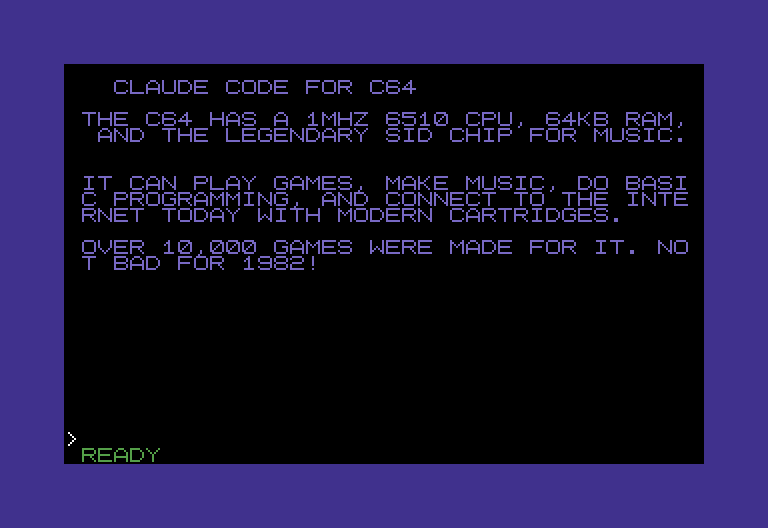

# claude64

Chat with Claude AI on a real Commodore 64.



## How it works

A 6502 assembly program runs on the Commodore 64 Ultimate, providing a chat UI. A Python bridge on your PC polls the C64's memory over Wi-Fi using the C64U's HTTP API, relays messages to Claude via `claude -p` (Claude Code CLI), and writes responses back to C64 memory.

```
┌─────────────┐   HTTP readmem/writemem   ┌──────────────┐   claude -p   ┌───────┐
│  C64 Program │ ◄──────────────────────► │  bridge.py   │ ◄──────────► │ Claude│
│  (6502 ASM)  │   shared memory @ $C000  │  (Linux PC)  │              │       │
└─────────────┘                           └──────────────┘              └───────┘
```

The C64 and bridge communicate through a memory-mapped mailbox protocol:

| Address | Purpose |
|---------|---------|
| `$C000` | Outgoing flag (0=idle, 1=message ready) |
| `$C001` | Message length |
| `$C002-$C0FF` | User message buffer (PETSCII) |
| `$C100` | Incoming flag (0=idle, 1=response ready) |
| `$C101-$C102` | Response length (lo/hi) |
| `$C103-$C4FF` | Response buffer |
| `$C500` | Bridge status (0=disconnected, 1=connected, 2=thinking) |

## Requirements

- [Commodore 64 Ultimate](https://www.commodore.net) with network connectivity (Wi-Fi or Ethernet)
- [Claude Code CLI](https://docs.anthropic.com/en/docs/claude-code) installed and authenticated
- [ACME cross-assembler](https://sourceforge.net/projects/acme-crossass/) (`apt install acme`)
- Python 3 with `requests` (`pip install requests`)

## Quick start

1. Connect your C64U to the same network as your PC
2. Note the C64U's IP address (found in Wired/Wi-Fi Network Setup)
3. Enable **FTP File Service**, **Telnet Remote Menu**, and **Web Remote Control** in C64U Menu > Network Services & Timezone
4. Update `C64U` IP in the `Makefile` if needed (default: `192.168.1.103`)
5. Build, deploy, and start:

```bash
make run
```

This assembles the 6502 program, pushes it to the C64U over the network, and starts the Python bridge. Type on the C64 keyboard and press RETURN to chat with Claude.

## Individual commands

```bash
make            # Assemble c64claude.prg
make deploy     # Build and push to C64U
make bridge     # Start the Python bridge only
make run        # Deploy + bridge in one step
make clean      # Remove built artifacts
```

## How the C64 program works

The 6502 assembly program (`c64claude.asm`, ~1.1KB compiled) provides:

- PETSCII box-drawing UI with title bar, chat area, input line, and status bar
- Keyboard input with backspace support
- Scrolling chat area (19 lines) with word wrapping
- Color-coded messages (green for user, light blue for Claude)
- Status display (WAITING FOR BRIDGE / READY / THINKING)

The program uses KERNAL routines (CHROUT, GETIN, PLOT) for I/O and direct screen/color RAM writes for scrolling performance.

## License

MIT
